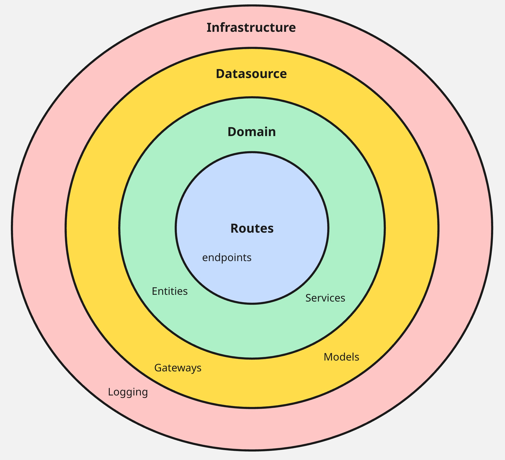
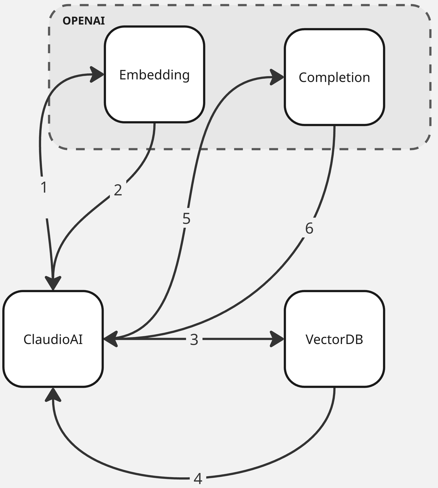

# ClaudioAI

This is ClaudioAI chatbot, inspired by ClaudIA from [Cloud Humans](https://www.cloudhumans.com/). It is primarily focused on the specified dataset, with a few questions and answers about Tesla Motors. However, it can easily be adapted to use other datasets and LLMs.

[Portuguese](README.pt.md)

## Architecture

The chosen architecture is based on Clean Architecture principles, with a focus on how the layers communicate with each other. It consists of three main layers: **routes**, **domain**, and **data** (or **datasource**).

- The **routes** layer handles incoming HTTP requests, middleware, and related concerns.
- The **domain** layer manages the business logic and communicates directly with the data layer.
- The **data** (or **datasource**) layer interacts with external APIs, such as OpenAI or vector databases.

<p align="center">
    
</p>

## How does it work?

The chatbot provides answers and information using a Large Language Model, such as OpenAI, along with a vector database. It embeds incoming messages using OpenAI’s embedding API, then searches the vector database for results most similar to the request. Finally, it uses OpenAI’s completion API to generate responses based on the vector database’s output.

The system is configured to only use results from the vector database with a score of 50% or higher, as this threshold provides a good starting point for more accurate answers. Additionally, if the vector database returns results labeled as **N2**, the system responds by indicating that the message should be escalated to a human.

<p align="center">
    
</p>


## How to execute

1. Create the `.env.dev` file based on the `.env.example` file;
2. Set the missing keys in `.env.dev`:  `OPENAI_KEY` and `VECTOR_DB_KEY`;
3. Run `docker build -t claudioai .` followed by `docker run -p 8000:8000 claudioai`.

Example of HTTP request:

```bash
curl --request POST \
  --url http://localhost:8000/conversations/completions \
  --header 'Content-Type: application/json' \
  --data '{
	"help_desk_id": 1,
	"project_name": "tesla_motors",
	"messages": [
		{
			"role": "USER",
			"content": "What is Tesla?"
		}
	]
}'
```