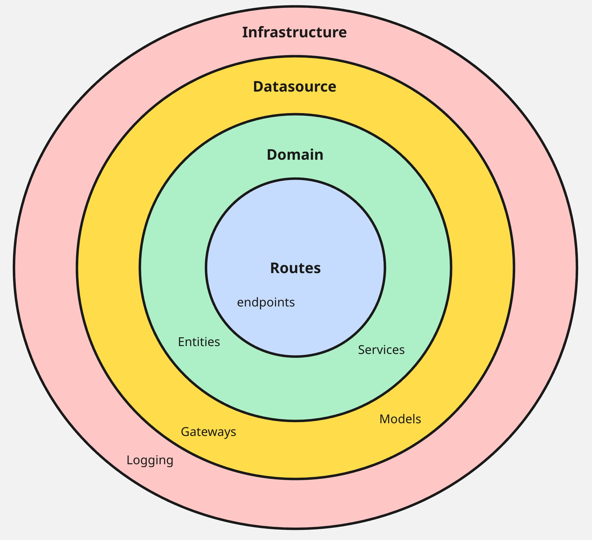

# ClaudioAI

Este é o chatbot **ClaudioAI**, inspirado no **ClaudIA** da [Cloud Humans](https://www.cloudhumans.com/). Ele é focado principalmente no conjunto de dados especificado, com algumas perguntas e respostas sobre a Tesla Motors. No entanto, pode ser facilmente adaptado para utilizar outros conjuntos de dados e LLMs.

## Arquitetura

A arquitetura escolhida é baseada nos princípios da Clean Architecture, com foco em como as camadas se comunicam entre si. Ela é composta por três camadas principais: **routes**, **domain** e **data** (ou **datasource**).

- A camada **routes** lida com requisições HTTP recebidas, middleware e questões relacionadas.
- A camada **domain** gerencia a lógica de negócio e se comunica diretamente com a camada de dados.
- A camada **data** (ou **datasource**) interage com APIs externas, como a OpenAI ou bancos de dados vetoriais.

<p align="center">
    
</p>

## Como funciona?

O chatbot fornece respostas e informações usando um Large Language Model (LLM), como o da OpenAI, junto com um banco de dados vetorial. Ele incorpora as mensagens recebidas utilizando a embedding API da OpenAI, em seguida pesquisa no banco de dados vetorial por resultados mais semelhantes à solicitação e, por fim, utiliza a completion API da OpenAI para gerar respostas com base no retorno do banco de dados vetorial.

O sistema está configurado para usar apenas resultados do banco de dados vetorial com pontuação igual ou superior a 50%, pois esse limite inicial ajuda a fornecer respostas mais precisas. Além disso, se o banco de dados vetorial retornar resultados rotulados como **N2**, o sistema indicará que a mensagem deve ser encaminhada para um humano.

<p align="center">
    
</p>

## Como executar

1. Defina as chaves que estão faltando no arquivo `.env.dev`: `OPENAI_KEY` e `VECTOR_DB_KEY`.

2. Execute `docker build -t claudioai .` e depois `docker run -p 8000:8000 claudioai`.

Exemplo de requisição HTTP:

```bash
curl --request POST \
  --url http://localhost:8000/conversations/completions \
  --header 'Content-Type: application/json' \
  --data '{
	"help_desk_id": 1,
	"project_name": "tesla_motors",
	"messages": [
		{
			"role": "USER",
			"content": "What is Tesla?"
		}
	]
}'
```